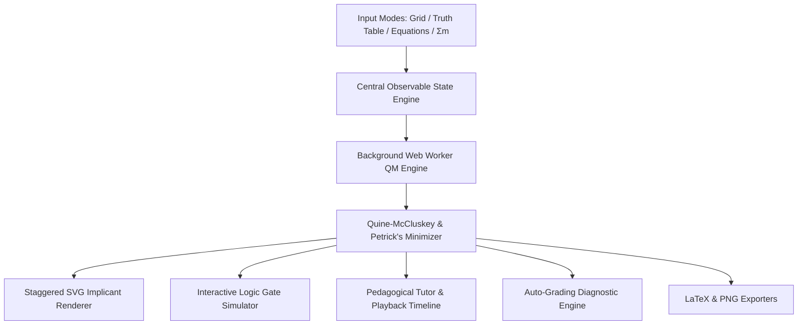

# Project Profile: Logic Routine

> **An Interactive, Concept-Driven Karnaugh Map Minimizer, Digital Logic Simulator & Pedagogical Boolean Tutor**

[](https://github.com/tahfimism/kmap)
[](LICENSE)
[]()
[]()
[]()

---

## 1. Executive Summary

**Logic Routine** is an open-source educational software suite designed to demystify **Boolean Algebra, Karnaugh Mapping (K-Maps), and Digital Logic Synthesis**. Unlike conventional algebraic calculators that simply compute answers, Logic Routine bridges the gap between **abstract boolean mathematics**, **spatial geometric intuition**, and **real-time electrical circuit behavior**.

Running 100% client-side in the browser without server dependencies, it combines an exact **Quine-McCluskey & Petrick's Method minimization engine** (offloaded to Web Workers) with an **interactive logic gate simulator**, **pedagogical step-by-step walkthroughs**, an **intelligent auto-grader with isomorphic challenge generators**, and **one-click LaTeX / PNG exports**.

---

## 2. Problem Statement & Motivation

### The Pedagogical Bottleneck
In foundational Computer Science and Electrical Engineering curricula, digital logic courses introduce Karnaugh Maps as the primary method for visual boolean minimization. However, students frequently face severe conceptual hurdles:

1. **Spatial Wrap-Around Confusion**: Toroidal edge and corner grouping rules (e.g., grouping cells $m_0, m_2, m_8, m_{10}$) feel counter-intuitive on flat $2\text{D}$ grids.
2. **Greedy Suboptimal Grouping**: Students struggle to distinguish between non-essential Prime Implicants and Essential Prime Implicants, frequently generating redundant loops.
3. **Disconnection from Physical Hardware**: Traditional software treats boolean minimization as pure text manipulation without illustrating how grouping reduces gate count, propagation delay, or transistor complexity.
4. **Lack of Adaptive Practice**: Static textbook problem sets lack instant diagnostic feedback explaining *why* a student's loop selection was suboptimal.

### The Solution: Logic Routine
Logic Routine solves these challenges by turning the learning process into an interactive visual feedback loop: students draw, navigate, simulate, and receive instant diagnostic grading.

---

## 3. Core Value Propositions & Key Innovations



### 🧠 1. Exact Algorithmic Rigor (Quine-McCluskey + Petrick's Method)
* Calculates absolute minimal Sum-of-Products (SOP) and Product-of-Sums (POS) representations across 2, 3, 4, and 5 variable boolean spaces (up to 32 minterms).
* Tabulation is offloaded to a background **Web Worker thread** (`js/solver-worker.js`) to guarantee $60\text{ FPS}$ UI responsiveness during complex Petrick expansions.

### ⚡ 2. Live Interactive Circuit Simulator
* Automatically synthesizes the minimized equation into a clean **Manhattan $90^\circ$ logic gate schematic** (AND-OR / OR-AND gate networks).
* **Interactive Variable Rails**: Clicking switches ($A, B, C, D, E$) toggles logic signals ($1$ vs $0$). Electrical state dynamically propagates across wires (glowing Emerald for High, muted Slate for Low) to calculate true logic levels reaching the output pin $Y$.

### 🎨 3. Anti-Blur Staggered Loop Rendering
* Solves the notorious visual overlapping problem in digital K-maps: overlapping loops receive calibrated incremental insets ($4\text{px}, 7.5\text{px}, 11\text{px}\dots$) and dashed borders for wrap-around terms.
* **Hover Focus Isolation**: Hovering an equation term dims non-target loops to **12% opacity** to highlight individual implicant geometries instantly.

### 🎯 4. Intelligent Auto-Grading Practice Mode
* Evaluates student groupings against a 4-pillar pedagogical rubric:
  1. **Zero Cells Excluded**: No logic $0$s caught inside groups.
  2. **Minterm Coverage**: Every logic $1$ minterm is covered.
  3. **Loop Maximization**: Loops are expanded to their largest valid power-of-2 dimension ($1, 2, 4, 8, 16$).
  4. **Minimal Loop Count**: Redundant overlapping loops are eliminated.
* **Isomorphic Variation Generator**: Preserves rectangular Gray-code adjacencies across 384 mathematical permutations per problem ($\text{idx} \oplus \text{mask}$).
* **Custom PYQ Loader**: Allows instructors and students to load custom Previous Year Questions from JSON files.

### ⌨️ 5. Ergonomics & Power-User Controls
* **Direct Keystroke Input**: Hover over any cell and press `0`, `1`, or `X`.
* **Spatial Keyboard Navigation (a11y)**: Navigate the entire grid using <kbd>&uarr;</kbd> <kbd>&darr;</kbd> <kbd>&larr;</kbd> <kbd>&rarr;</kbd> with high-contrast outline rings.
* **Linear 50-Step Undo/Redo**: Full history snapshots for both solver mode and practice loop drawing (`Ctrl+Z` / `Ctrl+Y`).
* **Onboarding Spotlight Guide**: 5-step interactive SVG cutout tour for first-time visitors with instant dismissal (<kbd>Escape</kbd>) and replay button (`?`).

---

## 4. Target Audience & Practical Use Cases

| Persona | Use Case | Benefit |
| :--- | :--- | :--- |
| **Undergraduate Students** (CS, EE, CE) | Homework self-study, exam preparation, understanding wrap-around logic | Instant feedback on practice problems with side-by-side optimal comparison |
| **University Professors & TAs** | Live classroom demonstrations, generating unique exam questions | Clear step-by-step playback, tiled wrap view, and custom JSON problem loading |
| **Hardware Engineers & Makers** | Quick logic simplification, gate reduction, lab report documentation | 1-click LaTeX equation export, Quine-McCluskey tables, and high-res PNG downloads |
| **Self-Taught Learners** | Understanding digital logic fundamentals from scratch | Guided onboarding tour, interactive circuit simulation, and pedagogical walkthroughs |

---

## 5. Technical Architecture & Tech Stack

```
Frontend Architecture: Pure Client-Side Single Page Application (SPA)
Runtime Dependencies: 0 (Zero external NPM packages required at runtime)
```

| Layer | Technologies Used | Purpose |
| :--- | :--- | :--- |
| **Presentation & UI** | HTML5, Tailwind CSS, SVG Canvas | Responsive dark-first interface, spring animations, dynamic circuit schematics |
| **State Management** | Vanilla JavaScript Observable Pattern | Central state store (`js/state.js`) with linear snapshot undo/redo & URL hash syncing |
| **Computation Engine** | Web Workers API, Quine-McCluskey Tabulation | Multi-threaded prime implicant extraction & Petrick's minimal cover algorithm |
| **Vector Rendering** | Dynamic SVG DOM Injection | Staggered offset implicant loops, dashed toroidal wraps, Manhattan wire paths |
| **Data & Storage** | LocalStorage API, JSON Schema | Preference persistence (dark theme, tour completion) & custom PYQ dataset loading |
| **Build Tooling (Optional)**| Tailwind CSS CLI, Node.js Test Harness | Static minification and zero-regression mock execution verification |

---

## 6. Project Directory Structure

```
d:/projects/kmap/
├── index.html            # Main semantic HTML5 interface & layout
├── package.json          # Tailwind CLI compilation scripts
├── tailwind.config.js    # Custom typography, colors, and spring transition curves
├── FEATURES.md           # Exhaustive technical feature specification
├── PROJECT_PROFILE.md    # Comprehensive project showcase & profile
├── js/
│   ├── state.js          # Central observable state store with undo/redo & URL hash
│   ├── solver.js         # Solver dispatcher with synchronous fallback
│   ├── solver-worker.js  # Dedicated background Web Worker for QM tabulation
│   ├── kmap.js           # Spatial keyboard navigation, keystrokes & grid generator
│   ├── svg.js            # SVG loop overlays, staggered offsets & focus isolation
│   ├── circuit.js        # Interactive logic circuit schematic & signal simulator
│   ├── tutorial.js       # Pedagogical walkthrough & step-by-step playback timeline
│   ├── practice.js       # Practice challenge engine, auto-grader & scorecard modal
│   ├── problems.js       # Curated default PYQ problem dataset
│   ├── export.js         # LaTeX generator, QM table exporter & PNG canvas exporter
│   ├── tour.js           # Spotlight cutout onboarding tour & popover engine
│   ├── inputs.js         # Multi-modal input synchronization (Truth Table, Minterms)
│   ├── tiled.js          # 3x3 infinite toroidal wrap viewer
│   ├── ui.js             # Formula renderer & focus isolation event bindings
│   └── app.js            # Main bootstrap orchestrator & event bus
```

---

## 7. Performance & Quality Benchmarks

* **Execution Time**: $< 5\text{ms}$ calculation latency for standard 4-variable maps; background thread execution prevents main-thread frame drops on 5-variable expansions.
* **Asset Footprint**: Total bundle size $< 150\text{ KB}$ (uncompressed), enabling instantaneous load times even over slow networks.
* **Zero Network Calls**: Runs natively from a USB drive or offline `file://` URL without requiring internet access or active web servers.
* **Cross-Browser Compatibility**: Validated on Google Chrome, Mozilla Firefox, Apple Safari, and Microsoft Edge across Desktop, Laptop, and Tablet viewport form-factors.

---

## 8. Quick Start & Installation

### Option A: Instant Browser Launch (No Build Required)
Simply clone the repository and open `index.html` directly in any modern web browser:
```bash
git clone https://github.com/tahfimism/kmap.git
cd kmap
# Open index.html in your default browser
start index.html       # Windows
open index.html        # macOS
xdg-open index.html    # Linux
```

### Option B: Development Mode (Tailwind CLI)
If you wish to modify styling and compile static CSS:
```bash
# Install development dependencies
npm install

# Watch for CSS changes during development
npm run watch:css

# Build minified CSS for production
npm run build:css
```

---

## 9. Future Roadmap & Extensibility

- [x] Full Quine-McCluskey + Petrick's Method solver (SOP & POS).
- [x] Live Interactive Logic Circuit Simulator with real-time signal propagation.
- [x] Anti-blur staggered SVG loops with toroidal dashed edge wrapping.
- [x] Spatial accessibility keyboard navigation & direct cell keystrokes.
- [x] Intelligent Practice Mode auto-grader with isomorphic challenge generators.
- [x] Pedagogical timeline playback controls.
- [x] LaTeX math & QM table generator + High-Res PNG exporter.
- [x] Spotlight Onboarding Tour with smart viewport placement.
- [ ] Multi-output Boolean function minimization (shared PLA term optimization).
- [ ] Verilog / VHDL hardware description export (`module kmap_minimized(...)`).
- [ ] Interactive Karnaugh Map 3D cube visualization for 5-variable maps using WebGL/Three.js.

---

## 10. License

This project is open-source and available under the [MIT License](LICENSE). Contributions, bug reports, and pedagogical feature proposals are welcome!
