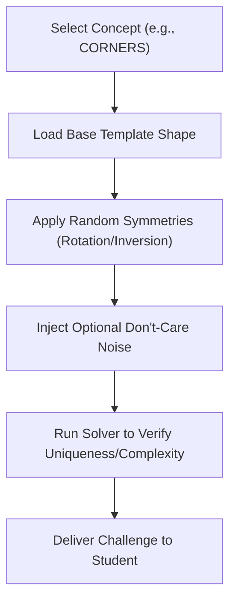

# Karnaugh Map Minimizer: Future Improvements

This document outlines high-impact feature proposals to enhance the Karnaugh Map learning tool, including a pedagogical deep-dive into improving the Practice Mode problem generation algorithm.

---

## 1. Feature Roadmap

### ⚡ Live Gate State Propagation
* **Concept**: Dynamically animate the logic gates in the circuit schematic based on the current user input values.
* **Details**: Hovering over cells or input rails toggles their state ($0$ or $1$), driving colored indicators (e.g., glowing green for High, dim red for Low) along the signal paths, logic gate symbols, and the output pin.

### 📊 Tabular Quine-McCluskey (QM) Solver Step-Viewer
* **Concept**: Bridge the visual nature of K-Maps with the tabular QM algorithm.
* **Details**: Add a tab visualizing the mathematical grouping process:
  1. **Grouped Implicant Table**: Columns dividing terms by number of active bits (combining $0$-differences).
  2. **Prime Implicant Coverage Chart**: The final selection matrix showing EPI extraction and coverage checks.

### 💡 Practice Mode "Intelligent Hints"
* **Concept**: Help stuck students without giving away the complete solution.
* **Details**: A hint engine that:
  * Identifies a cell with a $1$ that has not yet been grouped.
  * Detects if a user's loop is valid but can be doubled in size.
  * Flags redundant loops (consensus terms) that can be removed.

### 🛠️ Hardware Description Language (HDL) Exporter
* **Concept**: Connect academic theory to industrial application.
* **Details**: Generate copyable code blocks in **Verilog**, **VHDL**, and **SystemVerilog** matching the minimized Boolean equations.

### ⏱️ K-Map "Sprint" Challenge Game
* **Concept**: Gamify learning through speed runs.
* **Details**: A time-trial mode where students solve as many randomized maps as possible in $60$ seconds, tracking accuracy and speed.

---

## 2. Redesigning Practice Mode: Concept-Driven Problem Generation

### The Problem with Naive Random Generation
The current problem generator creates randomized maps by filling cells based on fixed percentages, filtering out trivial cases. This has major learning drawbacks:
1. **No Difficulty Curve**: Students get random combinations of easy and highly chaotic maps.
2. **Missing Specific Skills**: Wrap-around loops, corner groupings, or Don't-Care optimizations are rarely targeted.
3. **Ambiguity**: Random generation can create maps with multiple equally optimal solutions without explaining the choice to the student.

---

### The Proposed Algorithm: Concept-Targeted Generation

Instead of generating randomly and solving, we can construct the problem **synthetically by placing target loops**, and then applying **isomorphic transformations** (symmetries) to ensure variety.

#### A. Difficulty Levels & Concepts
We categorize challenges into structured curriculum sets:

| Level | Name | Concept Targeted | Example Placement |
| :--- | :--- | :--- | :--- |
| **Easy** | Adjacency | Simple horizontal/vertical groups of $2$ or $4$, no wrapping. | Cell pair $\{0, 1\}$ or $\{0, 1, 4, 5\}$ |
| **Medium** | Edge Wrap | Loops wrapping across the left-right or top-bottom boundaries. | Columns 0 and 3: $\{0, 2, 8, 10\}$ (corners) or $\{4, 7\}$ |
| **Medium** | Don't-Care Guide | Don't-cares ($X$) that must be grouped to form a larger, simpler loop. | Minterms at $\{0, 1\}$, Don't-cares at $\{2, 3\}$ |
| **Hard** | Redundancy | Loop configurations containing a tempting but redundant consensus loop. | Minterms at $\{1, 3, 4, 5, 9, 11\}$ (naive loop is $\{1, 3, 9, 11\}$) |
| **Hard** | Cyclic / Dual | Maps with multiple valid minimal coverage equations. | Minterms at $\{1, 2, 4, 7, 8, 11, 13, 14\}$ |

---

#### B. The Generation Pipeline

1. **Template Selection**: Load a base cell index array representing the chosen pattern. For example, the `CORNERS` template starts with minterms at $\{0, 2, 8, 10\}$ on a 4-variable map.
2. **Symmetry Transformations (Isomorphisms)**:
   * To prevent students from memorizing patterns, we shuffle the map variables.
   * **Variable Permutation**: Swap columns and rows by swapping variables (e.g., $A \leftrightarrow B$ or $C \leftrightarrow D$). This rotates or transposes the map.
   * **Variable Inversion**: Invert a variable's coordinates (e.g., replacing $A$ with $A'$). This mirrors or shifts rows/columns.
3. **Noise Injection**: Add $1$ or $2$ random don't-cares or isolated minterms to the edges, ensuring they do not merge or alter the primary target loop logic.
4. **Verification Step**: Run the Quine-McCluskey solver to ensure:
   * The map is solvable.
   * The optimal loops exactly match the target educational concept.
   * Multiple solutions (if cyclic) are flagged to the grading engine.

---

## 3. Deepthink Improvements: UX, UI, and Architectural Roadmap

This section provides a rigorous analysis of the current Karnaugh Map Solver, prioritizing enhancements across User Experience, User Interface, Domain Features, and Technical Architecture. The focus is strictly on maintaining the "Minimalist Utility" design system while scaling the application into a premium, professional-grade educational tool.

### 3.1. Deep Analysis & Strategic Directions

#### 1. User Experience (UX) & Interactions

**Critique of the Current `0 -> 1 -> X` Cycling Interaction:**
The click-to-cycle paradigm is fundamentally flawed for power users and inherently friction-heavy. Clicking a single cell twice just to reach an `X` state introduces unnecessary cognitive delay and physical fatigue, especially on 4V or 5V maps. Furthermore, accidental clicks require cycling completely through again, which is frustrating.

**Proposed Input Patterns (The "Paint & Type" Paradigm):**
*   **Keyboard Keystrokes (Hover + Type):** A user hovers over a cell and presses `0`, `1`, or `x` on their keyboard to instantly set the state.
*   **Click-and-Drag "Painting":** Allow users to select a brush state (e.g., "Set to 1") from a segmented control, then click and drag across multiple cells to paint them instantly.
*   **Binary String Parsing:** Provide a command-line-style input field where users can paste a 16-bit or 32-bit string (e.g., `101100X01...`) to populate the entire grid instantly.

**Mobile Ergonomics:**
*   **Touch-Safe Grids:** For 5-variable maps on mobile, cells become too small. We should implement a "Double-Tap to Zoom" or a panning canvas approach for the grid area, rather than shrinking cells below a $44 \times 44$ pixel touch target threshold.
*   **Bottom-Sheet Inputs:** Move control tabs and variable selections to a fixed bottom-sheet on mobile devices for strict one-handed accessibility.

**Undo/Redo & State Management:**
*   Implement a linear history stack leveraging a simplified Command Pattern or robust state diffing. The user can press `Ctrl+Z` / `Cmd+Z` to step backward seamlessly.

**Cognitive Load & Loop Clutter:**
*   **Hover Isolation (Focus Mode):** When a user hovers over an implicant in the output expression or the "Coverage Groups" list, the corresponding SVG loop on the K-Map should pulse/highlight (using the Emerald accent) while all other loops fade to 15% opacity.
*   **Step-by-Step Playback:** A timeline slider or "Next/Prev" arrows to walk through the implicant groupings sequentially, drawing one loop at a time.

#### 2. User Interface (UI) Polish

Adhering strictly to the **60-30-10** color rule and minimal, high-end hardware aesthetic.

**SVG Loop Aesthetics:**
*   Currently, multiple overlapping loops can become an unreadable blob of color.
*   **Distinct Staggered Layering:** Loops should never perfectly overlap their borders. Use staggered border offsets (e.g., Loop A at 2px inset, Loop B at 4px inset) or varying corner radii.
*   **Minimalist Styling:** Loops should use a thin `1.5px` border (using the Charcoal or Cream text color depending on theme) with an extremely faint fill (e.g., `rgba(16, 185, 129, 0.05)` for the Emerald accent when highlighted). Drop shadows should be completely omitted on SVG loops to avoid brutalist or chaotic overlapping. Dashed lines can be reserved *strictly* for representing wrap-around loops to visually imply continuity.

**Empty States & Onboarding:**
*   When the grid is completely $0$, display a large, crisp, ultra-low opacity watermark (e.g., a faint logic gate or `Y = 0`) behind the grid.
*   Replace standard empty text with micro-labels: `STATUS // AWAITING INPUT`. Use a subtle pulsing Emerald dot on the first cell ($m_0$) to guide the initial click.

**Accessibility (a11y):**
*   **Keyboard Navigation:** Use `Tab` or arrow keys to move spatial focus across the grid. The focused cell should use a high-contrast `ring-2 ring-cream-text dark:ring-charcoal-text` outline, distinct from the Emerald selection state.
*   **ARIA Live Regions:** Screen readers should announce the cell index and its new value when changed (e.g., "Cell m4 changed to Don't Care").

#### 3. New Features (Domain Specific)

**Product of Sums (POS) Integration:**
*   Add a sleek segmented control toggle (`SOP | POS`) adjacent to the output expression.
*   When POS is active, the solver must group the $0$s instead of $1$s. The UI should subtly shift context: the `0`s in the grid become `font-extrabold` and `text-cream-text`, while `1`s fade to the muted state.

**Truth Table Synchronization:**
*   An expanding/collapsing side panel containing a tightly-packed, monospaced Truth Table. As the user alters the K-Map, the Truth Table updates instantly, and scrolling is synchronized (hovering a row highlights the map cell).

**Procedural Logic Circuit Generation:**
*   Below the expression, draw a minimalist, monochrome schematic (SVG/Canvas).
*   Use standard IEEE/ANSI logic gate symbols with clean orthogonal routing (no diagonal lines, strict 90-degree corners, resembling high-end PCB traces).

**Exporting & Sharing:**
*   **LaTeX Export:** A one-click button to copy the Boolean expression or the tabular Q-M steps in pristine LaTeX format.
*   **Report-Ready PNGs:** Implement `html2canvas` to export the K-Map and expression with a transparent background, formatted specifically for inclusion in academic lab reports.
*   **URL State Sync:** Encode the current grid state into a Base64 URL parameter (e.g., `?state=10X011...`) for instant sharing among students.

#### 4. Technical Architecture & Refactoring

**Web Worker for Q-M Algorithm:**
*   The Q-M algorithm is $O(3^n / n)$. A 5-variable map with heavy don't-cares can block the main thread, causing the `cubic-bezier` spring animations to stutter.
*   **Solution:** Move the solver logic entirely to a Web Worker. The UI thread dispatches the grid array, and the worker returns the prime implicants asynchronously, ensuring zero UI jank.

**Tailwind Extraction & Build Process:**
*   Relying on the Tailwind CDN in production is an anti-pattern for performance and violates the high-end application vibe due to initial load flashing.
*   **Solution:** Introduce a minimal build step (e.g., Vite). Extract the custom configurations (60-30-10 palette, typography scales) into `tailwind.config.js` and build a static, highly minified CSS file.

**Componentization (Vanilla JS Custom Elements / Web Components):**
*   If staying away from React/Vue, refactor the single-file structure into native Web Components (e.g., `<kmap-grid>`, `<truth-table>`, `<logic-circuit>`). This encapsulates state and DOM manipulation, preventing the `app.js` file from becoming a monolithic God object.

---

### 3.2. Execution Roadmap (Prioritized Tiers)

#### 🟢 Tier 1: Quick Wins (High Impact, Low Effort)
1.  **Hover + Keystroke Input:** Implement keyboard event listeners on grid cells to instantly set values (`0`, `1`, `X`) without clicking.
2.  **Focus Isolation Mode:** Add hover event listeners to the "Coverage Groups" list to highlight specific SVG loops and fade out the rest.
3.  **URL State Sharing:** Read/write grid configuration to the URL hash for easy bookmarking and sharing.
4.  **UI Polish - Empty States:** Add minimal micro-labels (`AWAITING INPUT`) and the subtle pulsing guide dot to empty grids.

#### 🟡 Tier 2: Core Enhancements (Medium Effort, High Value)
1.  **Product of Sums (POS):** Refactor the solver to group $0$s and generate maxterm expressions. Add the SOP/POS toggle.
2.  **Undo/Redo Stack:** Implement a history array for grid states with `Cmd+Z` keyboard shortcut support.
3.  **Truth Table Side-Panel:** Create the synchronized, monospaced Truth Table view.
4.  **SVG Loop Redesign:** Refactor loop drawing math to include staggered insets for overlapping loops and strict `1.5px` un-shadowed borders.
5.  **Vite Build Setup:** Migrate away from Tailwind CDN; set up Vite for bundling JS and minifying CSS.

#### 🔴 Tier 3: Moonshots (Advanced/Architectural Features)
1.  **Web Worker Migration:** Offload the Quine-McCluskey engine to a background worker to ensure fluid UI animations on complex 5-variable maps.
2.  **Procedural Gate Schematic:** Develop an algorithmic routing engine to draw IEEE standard logic circuits based on the minimized equation.
3.  **Click-and-Drag "Painting":** Implement complex pointer event tracking (pointerdown, pointerenter, pointerup) to allow rapid painting of states across the grid.
4.  **LaTeX & High-Res PNG Export:** Integrate `html2canvas` and a LaTeX string generator for seamless lab report integration.
