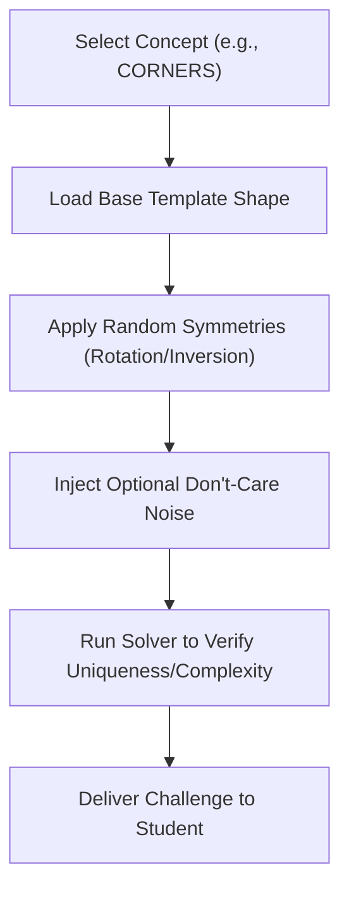

# Karnaugh Map Minimizer: Future Improvements

This document outlines high-impact feature proposals to enhance the Karnaugh Map learning tool, including a pedagogical deep-dive into improving the Practice Mode problem generation algorithm.

---

## 1. Feature Roadmap

### ⚡ Live Gate State Propagation
* **Concept**: Dynamically animate the logic gates in the circuit schematic based on the current user input values.
* **Details**: Hovering over cells or input rails toggles their state ($0$ or $1$), driving colored indicators (e.g., glowing green for High, dim red for Low) along the signal paths, logic gate symbols, and the output pin.

### 📊 Tabular Quine-McCluskey (QM) Solver Step-Viewer
* **Concept**: Bridge the visual nature of K-Maps with the tabular QM algorithm.
* **Details**: Add a tab visualizing the mathematical grouping process:
  1. **Grouped Implicant Table**: Columns dividing terms by number of active bits (combining $0$-differences).
  2. **Prime Implicant Coverage Chart**: The final selection matrix showing EPI extraction and coverage checks.

### 💡 Practice Mode "Intelligent Hints"
* **Concept**: Help stuck students without giving away the complete solution.
* **Details**: A hint engine that:
  * Identifies a cell with a $1$ that has not yet been grouped.
  * Detects if a user's loop is valid but can be doubled in size.
  * Flags redundant loops (consensus terms) that can be removed.

### 🛠️ Hardware Description Language (HDL) Exporter
* **Concept**: Connect academic theory to industrial application.
* **Details**: Generate copyable code blocks in **Verilog**, **VHDL**, and **SystemVerilog** matching the minimized Boolean equations.

### ⏱️ K-Map "Sprint" Challenge Game
* **Concept**: Gamify learning through speed runs.
* **Details**: A time-trial mode where students solve as many randomized maps as possible in $60$ seconds, tracking accuracy and speed.

---

## 2. Redesigning Practice Mode: Concept-Driven Problem Generation

### The Problem with Naive Random Generation
The current problem generator creates randomized maps by filling cells based on fixed percentages, filtering out trivial cases. This has major learning drawbacks:
1. **No Difficulty Curve**: Students get random combinations of easy and highly chaotic maps.
2. **Missing Specific Skills**: Wrap-around loops, corner groupings, or Don't-Care optimizations are rarely targeted.
3. **Ambiguity**: Random generation can create maps with multiple equally optimal solutions without explaining the choice to the student.

---

### The Proposed Algorithm: Concept-Targeted Generation

Instead of generating randomly and solving, we can construct the problem **synthetically by placing target loops**, and then applying **isomorphic transformations** (symmetries) to ensure variety.

#### A. Difficulty Levels & Concepts
We categorize challenges into structured curriculum sets:

| Level | Name | Concept Targeted | Example Placement |
| :--- | :--- | :--- | :--- |
| **Easy** | Adjacency | Simple horizontal/vertical groups of $2$ or $4$, no wrapping. | Cell pair $\{0, 1\}$ or $\{0, 1, 4, 5\}$ |
| **Medium** | Edge Wrap | Loops wrapping across the left-right or top-bottom boundaries. | Columns 0 and 3: $\{0, 2, 8, 10\}$ (corners) or $\{4, 7\}$ |
| **Medium** | Don't-Care Guide | Don't-cares ($X$) that must be grouped to form a larger, simpler loop. | Minterms at $\{0, 1\}$, Don't-cares at $\{2, 3\}$ |
| **Hard** | Redundancy | Loop configurations containing a tempting but redundant consensus loop. | Minterms at $\{1, 3, 4, 5, 9, 11\}$ (naive loop is $\{1, 3, 9, 11\}$) |
| **Hard** | Cyclic / Dual | Maps with multiple valid minimal coverage equations. | Minterms at $\{1, 2, 4, 7, 8, 11, 13, 14\}$ |

---

#### B. The Generation Pipeline

1. **Template Selection**: Load a base cell index array representing the chosen pattern. For example, the `CORNERS` template starts with minterms at $\{0, 2, 8, 10\}$ on a 4-variable map.
2. **Symmetry Transformations (Isomorphisms)**:
   * To prevent students from memorizing patterns, we shuffle the map variables.
   * **Variable Permutation**: Swap columns and rows by swapping variables (e.g., $A \leftrightarrow B$ or $C \leftrightarrow D$). This rotates or transposes the map.
   * **Variable Inversion**: Invert a variable's coordinates (e.g., replacing $A$ with $A'$). This mirrors or shifts rows/columns.
3. **Noise Injection**: Add $1$ or $2$ random don't-cares or isolated minterms to the edges, ensuring they do not merge or alter the primary target loop logic.
4. **Verification Step**: Run the Quine-McCluskey solver to ensure:
   * The map is solvable.
   * The optimal loops exactly match the target educational concept.
   * Multiple solutions (if cyclic) are flagged to the grading engine.
